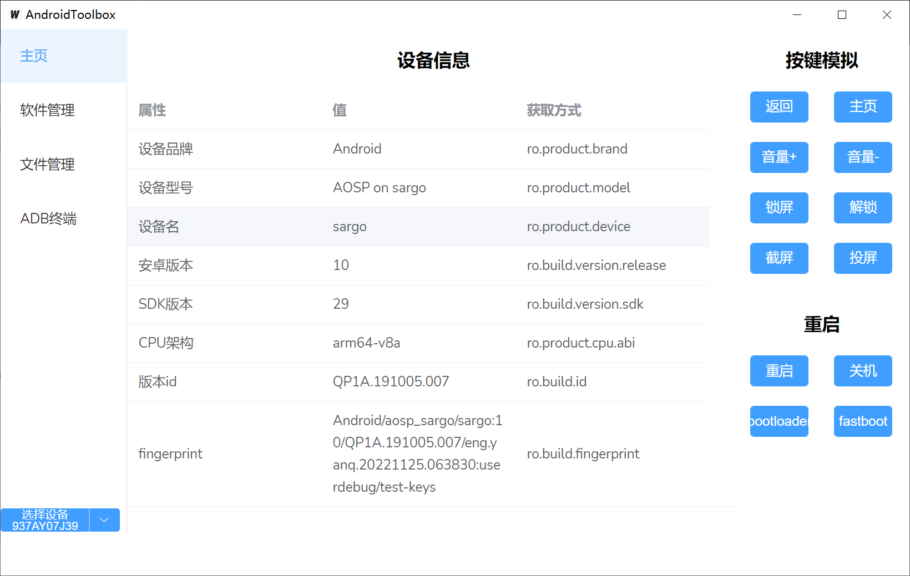
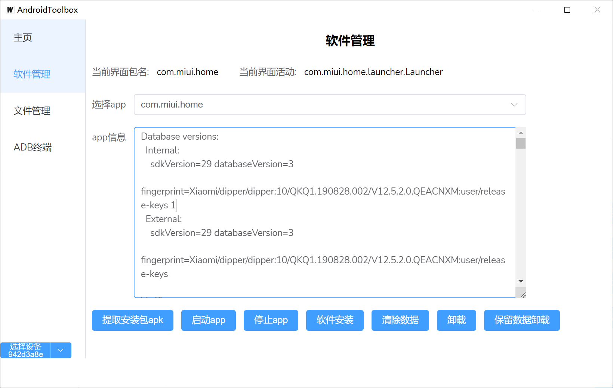
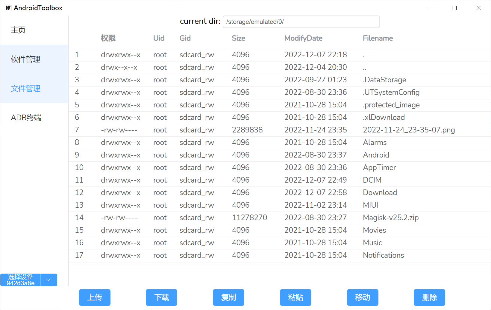
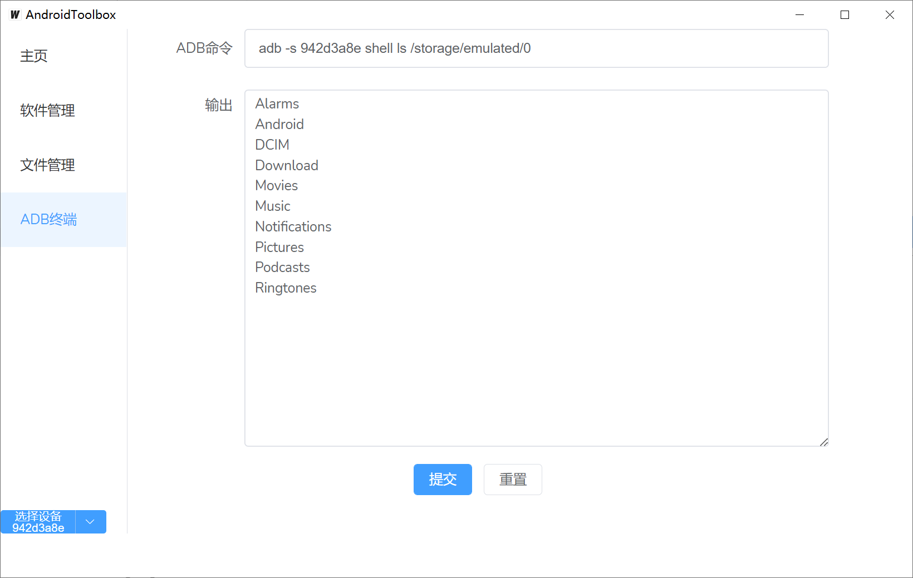

## About

Android Toolbox 

## how to use

- 主页：手机指纹查询、按键模拟、各种重启
- 软件管理：查看当前activity、app信息查看、启动、停止、提取、安装、卸载...
- 文件管理：文件管理器
- ADB终端：执行命令
- 多设备切换









## Building

first install golang、npm、upx(optional)，and wails

```
go install github.com/wailsapp/wails/v2/cmd/wails@latest
```

check env, if all conditions are met, just build

```
wails doctor
wails build -upx
```

## debug

and you can use `wails dev` to debug
